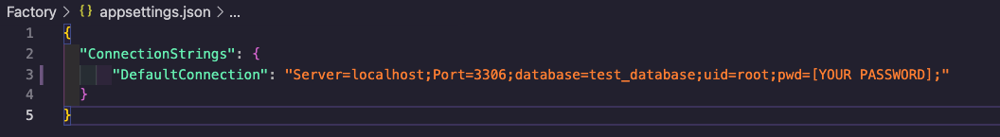

# Pierres Sweets and Treats
### An independent project using many-to-many relationships, authentication and authorization/ Epicodus Project

### By Theron Packus

## Technologies Used

* C#
* .NET 5.0
* ASP.NET Core MVC
* ASP.NET Core Identity
* Entity Framework Core
* MVC
* RESTful Routing, CRUD & HTTP
* REPL
* MySQL 
* Bootstrap
* HTML

## Description

This is an application to market Pierre's sweet and savory treats. The application needed to include a many to many relationship between treats and flavors. Also I had to use authentication and authorization so only registered users had full CRUD functionality.

## Setup/Installation Requirements

* _Requires Visual Studio Code Installation_
* _Requires Terminal Installation_
* _Open the terminal on your local machine_
* _Navigate to the directory inside of which you wish to house this project_
* _Clone this project with the following command  `$ git clone https://github.com/tlpackus/PierresTreats.Solution.git`_
* _Next you will need to download and install .NET Core through this link if you don't already have it: https://dotnet.microsoft.com/download_
* _After downloading and installing .NET Core, return to your terminal and navigate to the root directory by entering `$ cd PierresTreats.Solution`_
* _Open this project in Visual Studio Code with the command `$ code .`_
* _Still in the terminal, navigate to the desired subdirectory of the repository with the command `$ cd PierresTreats`_
* _Retrieve and install packages listed in the .csproj files with the command `$ dotnet restore`_
* _Create internal content for build with the command `$ dotnet build`_

**Instructions for re-creating the MySQL Database through a migration**
* _Open MySQL Workbench (If you don't already have it, it can be downloaded here: https://dev.mysql.com/downloads/file/?id=484391)_
* _From the `PierresTreats` directory run command `$ touch appsettings.json` to create a new file._
* _Input the following script_ (**note the name of the database below needs to match the name of the database you created (e.g. test_database)**)

* _Back in the terminal run command `$ dotnet ef migrations add Initial`_
* _Next run `$ dotnet ef database update`_
* _Your MySQL Workbench should now show a new Schema added_
* _You can now run $ dotnet run from the PierresTreats Directory to launch, view and use the app in the google browser_

## Known Bugs

- No known bugs so please lets me know if you encounter any through the email I provided below.

## License

[MIT](LICENSE.txt)

Copyright © 2021 Theron Packus

All Rights Reserved

## Support and Contact Information

For contact support or any found bugs, please email me here <a href = "mailto: tlpackus@gamil.com">Send Email</a>